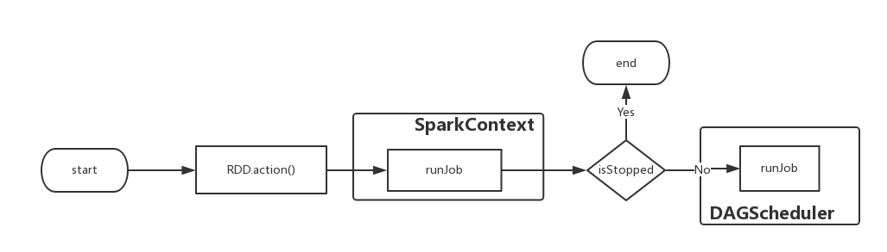
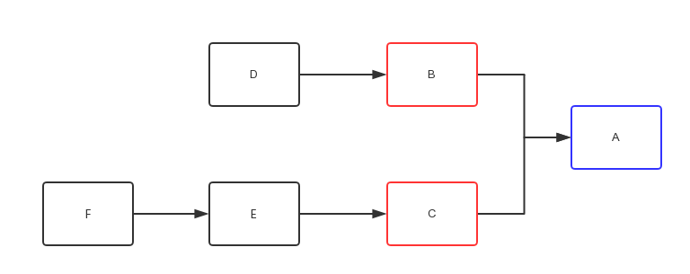
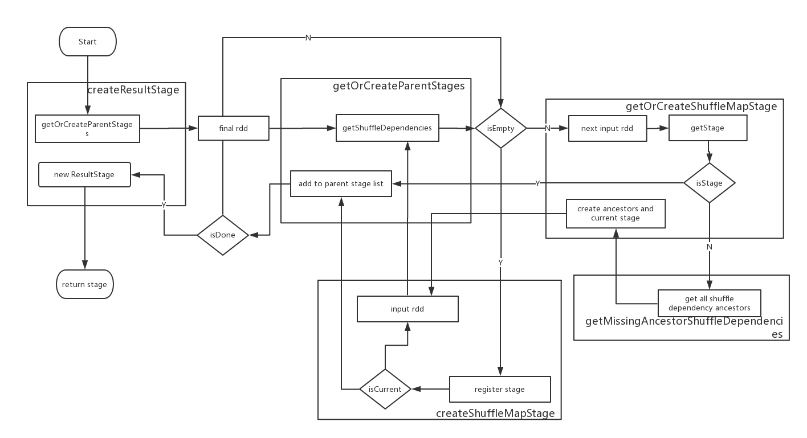

# 架构


## 调度

首先，当触发了rdd的action操作之后。将隐式的调用SparkContext中的runJob方法，这样便开始了整个调度过程

```scala
def runJob[T, U: ClassTag](
    rdd: RDD[T],
    func: (TaskContext, Iterator[T]) => U,
    partitions: Seq[Int],
    resultHandler: (Int, U) => Unit): Unit = {
  if (stopped.get()) {
    throw new IllegalStateException("SparkContext has been shutdown")
  }
  val callSite = getCallSite
  val cleanedFunc = clean(func)
  // ... ignore some codes
  dagScheduler.runJob(rdd, cleanedFunc, partitions, callSite, resultHandler, localProperties.get)
  progressBar.foreach(_.finishAll())
  rdd.doCheckpoint()
}
```

从上述代码可以看到，先判断当前SparkContext是否已经停下来了，之后做一些初始化的工作之后开始调用dagScheduler的runJob方法




```scala
def runJob[T, U](
    rdd: RDD[T],
    func: (TaskContext, Iterator[T]) => U,
    partitions: Seq[Int],
    callSite: CallSite,
    resultHandler: (Int, U) => Unit,
    properties: Properties): Unit = {
  val start = System.nanoTime
  val waiter = submitJob(rdd, func, partitions, callSite, resultHandler, properties)
  val awaitPermission = null.asInstanceOf[scala.concurrent.CanAwait]
  waiter.completionFuture.ready(Duration.Inf)(awaitPermission)
  waiter.completionFuture.value.get match {
    case scala.util.Success(_) =>
      logInfo("Job %d finished: %s, took %f s".format
        (waiter.jobId, callSite.shortForm, (System.nanoTime - start) / 1e9))
    case scala.util.Failure(exception) =>
      logInfo("Job %d failed: %s, took %f s".format
        (waiter.jobId, callSite.shortForm, (System.nanoTime - start) / 1e9))
      // SPARK-8644: Include user stack trace in exceptions coming from DAGScheduler.
      val callerStackTrace = Thread.currentThread().getStackTrace.tail
      exception.setStackTrace(exception.getStackTrace ++ callerStackTrace)
      throw exception
  }
}
```

runJob方法中继续调用submitJob方法将任务进行提交，并且创建JobWaiter对象，这里会发生阻塞，直到submitJob方法完成，返回作业完成或者失败的结果


```scala
def submitJob[T, U](
    rdd: RDD[T],
    func: (TaskContext, Iterator[T]) => U,
    partitions: Seq[Int],
    callSite: CallSite,
    resultHandler: (Int, U) => Unit,
    properties: Properties): JobWaiter[U] = {
  // Check to make sure we are not launching a task on a partition that does not exist.
  val maxPartitions = rdd.partitions.length
  partitions.find(p => p >= maxPartitions || p < 0).foreach { p =>
    throw new IllegalArgumentException(
      "Attempting to access a non-existent partition: " + p + ". " +
        "Total number of partitions: " + maxPartitions)
  }

  val jobId = nextJobId.getAndIncrement()
  if (partitions.size == 0) {
    // Return immediately if the job is running 0 tasks
    return new JobWaiter[U](this, jobId, 0, resultHandler)
  }

  assert(partitions.size > 0)
  val func2 = func.asInstanceOf[(TaskContext, Iterator[_]) => _]
  val waiter = new JobWaiter(this, jobId, partitions.size, resultHandler)
  eventProcessLoop.post(JobSubmitted(
    jobId, rdd, func2, partitions.toArray, callSite, waiter,
    SerializationUtils.clone(properties)))
  waiter
}
```

submitJob方法中首先根据输入的rdd得到最大分区的数目，然后做一个正确性判断，之后通过nextJobId得到当前任务的编号。接下来，如果输入的分区数目为0，则表明没有要计算的数据，可以直接返回；否则创建一个新的JobWaiter对象，主要将resultHandler传入，这样，在一个任务完成之后，可以调用taskSucceeded方法对结果进行处理。


```scala
private[spark] class JobWaiter[T](
    dagScheduler: DAGScheduler,
    val jobId: Int,
    totalTasks: Int,
    resultHandler: (Int, T) => Unit)
  extends JobListener with Logging {
  /*
  ... ignore some codes
  */
  override def taskSucceeded(index: Int, result: Any): Unit = {
    // resultHandler call must be synchronized in case resultHandler itself is not thread safe.
    synchronized {
      resultHandler(index, result.asInstanceOf[T])
    }
    if (finishedTasks.incrementAndGet() == totalTasks) {
      jobPromise.success(())
    }
  }

  override def jobFailed(exception: Exception): Unit = {
    if (!jobPromise.tryFailure(exception)) {
      logWarning("Ignore failure", exception)
    }
  }
}
```

对于创建好的JobWaiter，根据DAGSchedulerEvent中定义的事件类型创建“提交任务事件”，也就是代码里面看到的

```
JobSubmitted(jobId, rdd, func2, partitions.toArray, callSite,
   waiter, SerializationUtils.clone(properties))
```


之后通过DAGScheduler的内部类DAGSchedulerEventProcessLoop进行消息传递，DAGSchedulerEventProcessLoop继承了EventLoop，设计了针对接收到的不同事件的处理方法


```scala
private[scheduler] class DAGSchedulerEventProcessLoop(dagScheduler: DAGScheduler)
  extends EventLoop[DAGSchedulerEvent]("dag-scheduler-event-loop") with Logging {

  private[this] val timer = dagScheduler.metricsSource.messageProcessingTimer

  override def onReceive(event: DAGSchedulerEvent): Unit = {
    val timerContext = timer.time()
    try {
      doOnReceive(event)
    } finally {
      timerContext.stop()
    }
  }

  private def doOnReceive(event: DAGSchedulerEvent): Unit = event match {
    case JobSubmitted(jobId, rdd, func, partitions, callSite, listener, properties) =>
      dagScheduler.handleJobSubmitted(jobId, rdd, func, partitions, callSite, listener, properties)
    // ... ignore some codes
    case ResubmitFailedStages =>
      dagScheduler.resubmitFailedStages()
  }

  override def onError(e: Throwable): Unit = {
    logError("DAGSchedulerEventProcessLoop failed; shutting down SparkContext", e)
    try {
      dagScheduler.doCancelAllJobs()
    } catch {
      case t: Throwable => logError("DAGScheduler failed to cancel all jobs.", t)
    }
    dagScheduler.sc.stopInNewThread()
  }

  override def onStop(): Unit = {
    // Cancel any active jobs in postStop hook
    dagScheduler.cleanUpAfterSchedulerStop()
  }
}
```

可以发现，尽管接收到了处理的消息，但是具体处理的方法仍然在DAGScheduler中完成，对于JobSubmitted事件，调用handleJobSubmitted方法

```Scala
private[scheduler] def handleJobSubmitted(jobId: Int,
    finalRDD: RDD[_],
    func: (TaskContext, Iterator[_]) => _,
    partitions: Array[Int],
    callSite: CallSite,
    listener: JobListener,
    properties: Properties) {
  var finalStage: ResultStage = null
  try {
    finalStage = createResultStage(finalRDD, func, partitions, jobId, callSite)
  } catch {
    case e: Exception =>
      logWarning("Creating new stage failed due to exception - job: " + jobId, e)
      listener.jobFailed(e)
      return
  }

  val job = new ActiveJob(jobId, finalStage, callSite, listener, properties)
  clearCacheLocs()
  // ... ignore some codes

  val jobSubmissionTime = clock.getTimeMillis()
  jobIdToActiveJob(jobId) = job
  activeJobs += job
  finalStage.setActiveJob(job)
  val stageIds = jobIdToStageIds(jobId).toArray
  val stageInfos = stageIds.flatMap(id => stageIdToStage.get(id).map(_.latestInfo))
  listenerBus.post(
    SparkListenerJobStart(job.jobId, jobSubmissionTime, stageInfos, properties))
  submitStage(finalStage)
}

```

handleJobSubmitted方法里面首先根据输入的rdd // TODO


```scala
private def createResultStage(
    rdd: RDD[_],
    func: (TaskContext, Iterator[_]) => _,
    partitions: Array[Int],
    jobId: Int,
    callSite: CallSite): ResultStage = {
  val parents = getOrCreateParentStages(rdd, jobId)
  val id = nextStageId.getAndIncrement()
  val stage = new ResultStage(id, rdd, func, partitions, parents, jobId, callSite)
  stageIdToStage(id) = stage
  updateJobIdStageIdMaps(jobId, stage)
  stage
}

private def getOrCreateParentStages(rdd: RDD[_], firstJobId: Int): List[Stage] = {
  getShuffleDependencies(rdd).map { shuffleDep =>
    getOrCreateShuffleMapStage(shuffleDep, firstJobId)
  }.toList
}

private[scheduler] def getShuffleDependencies(
    rdd: RDD[_]): HashSet[ShuffleDependency[_, _, _]] = {
  val parents = new HashSet[ShuffleDependency[_, _, _]]
  val visited = new HashSet[RDD[_]]
  val waitingForVisit = new Stack[RDD[_]]
  waitingForVisit.push(rdd)
  while (waitingForVisit.nonEmpty) {
    val toVisit = waitingForVisit.pop()
    if (!visited(toVisit)) {
      visited += toVisit
      toVisit.dependencies.foreach {
        case shuffleDep: ShuffleDependency[_, _, _] =>
          parents += shuffleDep
        case dependency =>
          waitingForVisit.push(dependency.rdd)
      }
    }
  }
  parents
}
```

createResultStage方法里面首先需要针对输入的rdd寻找它的依赖，getOrCreateParentStages方法里面先按照getShuffleDependencies，根据输入的RDD按照广度优先的方法，找到第一层的宽依赖，如下图



假设图中两两RDD之间均为宽依赖，那么如果RDD A作为getShuffleDependencies函数的输入，那么得到的结果就是包含RDD B和RDD C的集合

```scala
private def getOrCreateShuffleMapStage(
    shuffleDep: ShuffleDependency[_, _, _],
    firstJobId: Int): ShuffleMapStage = {
  shuffleIdToMapStage.get(shuffleDep.shuffleId) match {
    case Some(stage) =>
      stage

    case None =>
      getMissingAncestorShuffleDependencies(shuffleDep.rdd).foreach { dep =>
        if (!shuffleIdToMapStage.contains(dep.shuffleId)) {
          createShuffleMapStage(dep, firstJobId)
        }
      }
      createShuffleMapStage(shuffleDep, firstJobId)
  }
}

private def getMissingAncestorShuffleDependencies(
    rdd: RDD[_]): Stack[ShuffleDependency[_, _, _]] = {
  val ancestors = new Stack[ShuffleDependency[_, _, _]]
  val visited = new HashSet[RDD[_]]
  val waitingForVisit = new Stack[RDD[_]]
  waitingForVisit.push(rdd)
  while (waitingForVisit.nonEmpty) {
    val toVisit = waitingForVisit.pop()
    if (!visited(toVisit)) {
      visited += toVisit
      getShuffleDependencies(toVisit).foreach { shuffleDep =>
        if (!shuffleIdToMapStage.contains(shuffleDep.shuffleId)) {
          ancestors.push(shuffleDep)
          waitingForVisit.push(shuffleDep.rdd)
        } // Otherwise, the dependency and its ancestors have already been registered.
      }
    }
  }
  ancestors
}

def createShuffleMapStage(shuffleDep: ShuffleDependency[_, _, _], jobId: Int): ShuffleMapStage = {
  val rdd = shuffleDep.rdd
  val numTasks = rdd.partitions.length
  val parents = getOrCreateParentStages(rdd, jobId)
  val id = nextStageId.getAndIncrement()
  val stage = new ShuffleMapStage(id, rdd, numTasks, parents, jobId, rdd.creationSite, shuffleDep)

  stageIdToStage(id) = stage
  shuffleIdToMapStage(shuffleDep.shuffleId) = stage
  updateJobIdStageIdMaps(jobId, stage)

  // ... ignore some codes
  stage
}

```

上面的几个函数是DAGScheduler根据宽依赖切分Stage的核心过程，该过程采用递归调用的方法，比较绕。看图边看图边分析下具体过程。



```Scala
/** Submits stage, but first recursively submits any missing parents. */
private def submitStage(stage: Stage) {
  val jobId = activeJobForStage(stage)
  if (jobId.isDefined) {
    logDebug("submitStage(" + stage + ")")
    if (!waitingStages(stage) && !runningStages(stage) && !failedStages(stage)) {
      val missing = getMissingParentStages(stage).sortBy(_.id)
      logDebug("missing: " + missing)
      if (missing.isEmpty) {
        logInfo("Submitting " + stage + " (" + stage.rdd + "), which has no missing parents")
        submitMissingTasks(stage, jobId.get)
      } else {
        for (parent <- missing) {
          submitStage(parent)
        }
        waitingStages += stage
      }
    }
  } else {
    abortStage(stage, "No active job for stage " + stage.id, None)
  }
}
```


```Scala
/** Called when stage's parents are available and we can now do its task. */
private def submitMissingTasks(stage: Stage, jobId: Int) {
  logDebug("submitMissingTasks(" + stage + ")")
  // Get our pending tasks and remember them in our pendingTasks entry
  stage.pendingPartitions.clear()

  // First figure out the indexes of partition ids to compute.
  val partitionsToCompute: Seq[Int] = stage.findMissingPartitions()

  // Use the scheduling pool, job group, description, etc. from an ActiveJob associated
  // with this Stage
  val properties = jobIdToActiveJob(jobId).properties

  runningStages += stage
  // SparkListenerStageSubmitted should be posted before testing whether tasks are
  // serializable. If tasks are not serializable, a SparkListenerStageCompleted event
  // will be posted, which should always come after a corresponding SparkListenerStageSubmitted
  // event.
  stage match {
    case s: ShuffleMapStage =>
      outputCommitCoordinator.stageStart(stage = s.id, maxPartitionId = s.numPartitions - 1)
    case s: ResultStage =>
      outputCommitCoordinator.stageStart(
        stage = s.id, maxPartitionId = s.rdd.partitions.length - 1)
  }
  val taskIdToLocations: Map[Int, Seq[TaskLocation]] = try {
    stage match {
      case s: ShuffleMapStage =>
        partitionsToCompute.map { id => (id, getPreferredLocs(stage.rdd, id))}.toMap
      case s: ResultStage =>
        partitionsToCompute.map { id =>
          val p = s.partitions(id)
          (id, getPreferredLocs(stage.rdd, p))
        }.toMap
    }
  } catch {
    case NonFatal(e) =>
      stage.makeNewStageAttempt(partitionsToCompute.size)
      listenerBus.post(SparkListenerStageSubmitted(stage.latestInfo, properties))
      abortStage(stage, s"Task creation failed: $e\n${Utils.exceptionString(e)}", Some(e))
      runningStages -= stage
      return
  }

  stage.makeNewStageAttempt(partitionsToCompute.size, taskIdToLocations.values.toSeq)
  listenerBus.post(SparkListenerStageSubmitted(stage.latestInfo, properties))

  // TODO: Maybe we can keep the taskBinary in Stage to avoid serializing it multiple times.
  // Broadcasted binary for the task, used to dispatch tasks to executors. Note that we broadcast
  // the serialized copy of the RDD and for each task we will deserialize it, which means each
  // task gets a different copy of the RDD. This provides stronger isolation between tasks that
  // might modify state of objects referenced in their closures. This is necessary in Hadoop
  // where the JobConf/Configuration object is not thread-safe.
  var taskBinary: Broadcast[Array[Byte]] = null
  try {
    // For ShuffleMapTask, serialize and broadcast (rdd, shuffleDep).
    // For ResultTask, serialize and broadcast (rdd, func).
    val taskBinaryBytes: Array[Byte] = stage match {
      case stage: ShuffleMapStage =>
        JavaUtils.bufferToArray(
          closureSerializer.serialize((stage.rdd, stage.shuffleDep): AnyRef))
      case stage: ResultStage =>
        JavaUtils.bufferToArray(closureSerializer.serialize((stage.rdd, stage.func): AnyRef))
    }

    taskBinary = sc.broadcast(taskBinaryBytes)
  } catch {
    // In the case of a failure during serialization, abort the stage.
    case e: NotSerializableException =>
      abortStage(stage, "Task not serializable: " + e.toString, Some(e))
      runningStages -= stage

      // Abort execution
      return
    case NonFatal(e) =>
      abortStage(stage, s"Task serialization failed: $e\n${Utils.exceptionString(e)}", Some(e))
      runningStages -= stage
      return
  }

  val tasks: Seq[Task[_]] = try {
    stage match {
      case stage: ShuffleMapStage =>
        partitionsToCompute.map { id =>
          val locs = taskIdToLocations(id)
          val part = stage.rdd.partitions(id)
          new ShuffleMapTask(stage.id, stage.latestInfo.attemptId,
            taskBinary, part, locs, stage.latestInfo.taskMetrics, properties, Option(jobId),
            Option(sc.applicationId), sc.applicationAttemptId)
        }

      case stage: ResultStage =>
        partitionsToCompute.map { id =>
          val p: Int = stage.partitions(id)
          val part = stage.rdd.partitions(p)
          val locs = taskIdToLocations(id)
          new ResultTask(stage.id, stage.latestInfo.attemptId,
            taskBinary, part, locs, id, properties, stage.latestInfo.taskMetrics,
            Option(jobId), Option(sc.applicationId), sc.applicationAttemptId)
        }
    }
  } catch {
    case NonFatal(e) =>
      abortStage(stage, s"Task creation failed: $e\n${Utils.exceptionString(e)}", Some(e))
      runningStages -= stage
      return
  }

  if (tasks.size > 0) {
    logInfo("Submitting " + tasks.size + " missing tasks from " + stage + " (" + stage.rdd + ")")
    stage.pendingPartitions ++= tasks.map(_.partitionId)
    logDebug("New pending partitions: " + stage.pendingPartitions)
    taskScheduler.submitTasks(new TaskSet(
      tasks.toArray, stage.id, stage.latestInfo.attemptId, jobId, properties))
    stage.latestInfo.submissionTime = Some(clock.getTimeMillis())
  } else {
    // Because we posted SparkListenerStageSubmitted earlier, we should mark
    // the stage as completed here in case there are no tasks to run
    markStageAsFinished(stage, None)

    val debugString = stage match {
      case stage: ShuffleMapStage =>
        s"Stage ${stage} is actually done; " +
          s"(available: ${stage.isAvailable}," +
          s"available outputs: ${stage.numAvailableOutputs}," +
          s"partitions: ${stage.numPartitions})"
      case stage : ResultStage =>
        s"Stage ${stage} is actually done; (partitions: ${stage.numPartitions})"
    }
    logDebug(debugString)

    submitWaitingChildStages(stage)
  }
}

```
