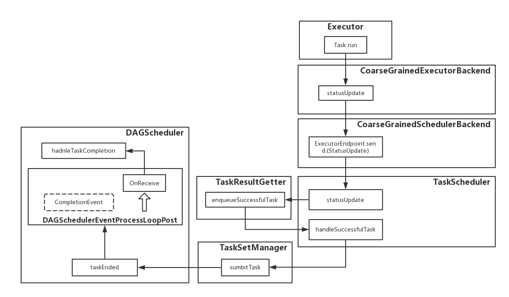

# 架构

[TOC]

## 调度

### 提交作业

首先，当触发了rdd的action操作之后。将隐式的调用SparkContext中的runJob方法，这样便开始了整个调度过程

```scala
def runJob[T, U: ClassTag](
    rdd: RDD[T],
    func: (TaskContext, Iterator[T]) => U,
    partitions: Seq[Int],
    resultHandler: (Int, U) => Unit): Unit = {
  if (stopped.get()) {
    throw new IllegalStateException("SparkContext has been shutdown")
  }
  val callSite = getCallSite
  val cleanedFunc = clean(func)
  // ... ignore some codes
  dagScheduler.runJob(rdd, cleanedFunc, partitions, callSite, resultHandler, localProperties.get)
  progressBar.foreach(_.finishAll())
  rdd.doCheckpoint()
}
```

从上述代码可以看到，先判断当前SparkContext是否已经停下来了，之后做一些初始化的工作之后开始调用dagScheduler的runJob方法


```scala
def runJob[T, U](
    rdd: RDD[T],
    func: (TaskContext, Iterator[T]) => U,
    partitions: Seq[Int],
    callSite: CallSite,
    resultHandler: (Int, U) => Unit,
    properties: Properties): Unit = {
  val start = System.nanoTime
  val waiter = submitJob(rdd, func, partitions, callSite, resultHandler, properties)
  val awaitPermission = null.asInstanceOf[scala.concurrent.CanAwait]
  waiter.completionFuture.ready(Duration.Inf)(awaitPermission)
  waiter.completionFuture.value.get match {
    case scala.util.Success(_) =>
      logInfo("Job %d finished: %s, took %f s".format
        (waiter.jobId, callSite.shortForm, (System.nanoTime - start) / 1e9))
    case scala.util.Failure(exception) =>
      logInfo("Job %d failed: %s, took %f s".format
        (waiter.jobId, callSite.shortForm, (System.nanoTime - start) / 1e9))
      // SPARK-8644: Include user stack trace in exceptions coming from DAGScheduler.
      val callerStackTrace = Thread.currentThread().getStackTrace.tail
      exception.setStackTrace(exception.getStackTrace ++ callerStackTrace)
      throw exception
  }
}
```

runJob方法中继续调用submitJob方法将任务进行提交，并且创建JobWaiter对象，这里会发生阻塞，直到submitJob方法完成，返回作业完成或者失败的结果


```scala
def submitJob[T, U](
    rdd: RDD[T],
    func: (TaskContext, Iterator[T]) => U,
    partitions: Seq[Int],
    callSite: CallSite,
    resultHandler: (Int, U) => Unit,
    properties: Properties): JobWaiter[U] = {
  val maxPartitions = rdd.partitions.length
  partitions.find(p => p >= maxPartitions || p < 0).foreach { p =>
    throw new IllegalArgumentException(
      "Attempting to access a non-existent partition: " + p + ". " +
        "Total number of partitions: " + maxPartitions)
  }

  val jobId = nextJobId.getAndIncrement()
  if (partitions.size == 0) {
    return new JobWaiter[U](this, jobId, 0, resultHandler)
  }

  assert(partitions.size > 0)
  val func2 = func.asInstanceOf[(TaskContext, Iterator[_]) => _]
  val waiter = new JobWaiter(this, jobId, partitions.size, resultHandler)
  eventProcessLoop.post(JobSubmitted(
    jobId, rdd, func2, partitions.toArray, callSite, waiter,
    SerializationUtils.clone(properties)))
  waiter
}
```

submitJob方法中首先根据输入的rdd得到最大分区的数目，然后做一个正确性判断，之后通过nextJobId得到当前任务的编号。接下来，如果输入的分区数目为0，则表明没有要计算的数据，可以直接返回；否则创建一个新的JobWaiter对象，主要将resultHandler传入，这样，在一个任务完成之后，可以调用taskSucceeded方法对结果进行处理。


```scala
private[spark] class JobWaiter[T](
    dagScheduler: DAGScheduler,
    val jobId: Int,
    totalTasks: Int,
    resultHandler: (Int, T) => Unit)
  extends JobListener with Logging {
  /*
  ... ignore some codes
  */
  override def taskSucceeded(index: Int, result: Any): Unit = {
    synchronized {
      resultHandler(index, result.asInstanceOf[T])
    }
    if (finishedTasks.incrementAndGet() == totalTasks) {
      jobPromise.success(())
    }
  }

  override def jobFailed(exception: Exception): Unit = {
    if (!jobPromise.tryFailure(exception)) {
      logWarning("Ignore failure", exception)
    }
  }
}
```

对于创建好的JobWaiter，根据DAGSchedulerEvent中定义的事件类型创建“提交任务事件”，也就是代码里面看到的

```scala
JobSubmitted(jobId, rdd, func2, partitions.toArray, callSite,
   waiter, SerializationUtils.clone(properties))
```


之后通过DAGScheduler的内部类DAGSchedulerEventProcessLoop进行消息传递，DAGSchedulerEventProcessLoop继承了EventLoop，设计了针对接收到的不同事件的处理方法


```scala
private[scheduler] class DAGSchedulerEventProcessLoop(dagScheduler: DAGScheduler)
  extends EventLoop[DAGSchedulerEvent]("dag-scheduler-event-loop") with Logging {

  private[this] val timer = dagScheduler.metricsSource.messageProcessingTimer

  override def onReceive(event: DAGSchedulerEvent): Unit = {
    val timerContext = timer.time()
    try {
      doOnReceive(event)
    } finally {
      timerContext.stop()
    }
  }

  private def doOnReceive(event: DAGSchedulerEvent): Unit = event match {
    case JobSubmitted(jobId, rdd, func, partitions, callSite, listener, properties) =>
      dagScheduler.handleJobSubmitted(jobId, rdd, func, partitions, callSite, listener, properties)
    // ... ignore some codes
    case ResubmitFailedStages =>
      dagScheduler.resubmitFailedStages()
  }
}
```

### 划分调度

可以发现，尽管接收到了处理的消息，但是具体处理的方法仍然在DAGScheduler中完成，对于JobSubmitted事件，调用handleJobSubmitted方法

```Scala
private[scheduler] def handleJobSubmitted(jobId: Int,
    finalRDD: RDD[_],
    func: (TaskContext, Iterator[_]) => _,
    partitions: Array[Int],
    callSite: CallSite,
    listener: JobListener,
    properties: Properties) {
  var finalStage: ResultStage = null
  try {
    finalStage = createResultStage(finalRDD, func, partitions, jobId, callSite)
  } catch {
    case e: Exception =>
      logWarning("Creating new stage failed due to exception - job: " + jobId, e)
      listener.jobFailed(e)
      return
  }
  // ... ignore some codes
}

```

handleJobSubmitted方法里面首先根据输入的rdd创建好Result Stage，这部分过程相对复杂，下面将结合代码和流程图分析。


```scala
private def createResultStage(
    rdd: RDD[_],
    func: (TaskContext, Iterator[_]) => _,
    partitions: Array[Int],
    jobId: Int,
    callSite: CallSite): ResultStage = {
  val parents = getOrCreateParentStages(rdd, jobId)
  val id = nextStageId.getAndIncrement()
  val stage = new ResultStage(id, rdd, func, partitions, parents, jobId, callSite)
  stageIdToStage(id) = stage
  updateJobIdStageIdMaps(jobId, stage)
  stage
}

private def getOrCreateParentStages(rdd: RDD[_], firstJobId: Int): List[Stage] = {
  getShuffleDependencies(rdd).map { shuffleDep =>
    getOrCreateShuffleMapStage(shuffleDep, firstJobId)
  }.toList
}

private[scheduler] def getShuffleDependencies(
    rdd: RDD[_]): HashSet[ShuffleDependency[_, _, _]] = {
  val parents = new HashSet[ShuffleDependency[_, _, _]]
  val visited = new HashSet[RDD[_]]
  val waitingForVisit = new Stack[RDD[_]]
  waitingForVisit.push(rdd)
  while (waitingForVisit.nonEmpty) {
    val toVisit = waitingForVisit.pop()
    if (!visited(toVisit)) {
      visited += toVisit
      toVisit.dependencies.foreach {
        case shuffleDep: ShuffleDependency[_, _, _] =>
          parents += shuffleDep
        case dependency =>
          waitingForVisit.push(dependency.rdd)
      }
    }
  }
  parents
}
```

createResultStage方法里面首先需要针对输入的rdd寻找它的依赖，getOrCreateParentStages方法里面先按照getShuffleDependencies，根据输入的RDD按照广度优先的方法，找到第一层的宽依赖，如下图


假设图中两两RDD之间均为宽依赖，那么如果RDD A作为getShuffleDependencies函数的输入，那么得到的结果就是包含RDD B和RDD C的集合

```scala
private def getOrCreateShuffleMapStage(
    shuffleDep: ShuffleDependency[_, _, _],
    firstJobId: Int): ShuffleMapStage = {
  shuffleIdToMapStage.get(shuffleDep.shuffleId) match {
    case Some(stage) =>
      stage

    case None =>
      getMissingAncestorShuffleDependencies(shuffleDep.rdd).foreach { dep =>
        if (!shuffleIdToMapStage.contains(dep.shuffleId)) {
          // 这里仅仅是创建了shuffleMapStage并注册，并不作为返回，只有下面一个真正返回
          createShuffleMapStage(dep, firstJobId)
        }
      }
      createShuffleMapStage(shuffleDep, firstJobId)
  }
}

// 获取所有祖先中的宽依赖
private def getMissingAncestorShuffleDependencies(
    rdd: RDD[_]): Stack[ShuffleDependency[_, _, _]] = {
// ... ignore some codes
}

def createShuffleMapStage(shuffleDep: ShuffleDependency[_, _, _], jobId: Int): ShuffleMapStage = {
  val rdd = shuffleDep.rdd
  val numTasks = rdd.partitions.length
  val parents = getOrCreateParentStages(rdd, jobId)
  val id = nextStageId.getAndIncrement()
  val stage = new ShuffleMapStage(id, rdd, numTasks, parents, jobId, rdd.creationSite, shuffleDep)

  stageIdToStage(id) = stage
  shuffleIdToMapStage(shuffleDep.shuffleId) = stage
  updateJobIdStageIdMaps(jobId, stage)

  // ... ignore some codes
  stage
}

```

getOrCreateShuffleMapStage方法是将输入的宽依赖，判断所对应的ShuffleMapStage是否已经创建了，如果没有的话，首先将他的所有祖先创建ShuffleMapStage，然后在创建自己的ShuffleMapStage并返回

getMissingAncestorShuffleDependencies方法负责找到输入rdd的所有祖先里的宽依赖rdd

createShuffleMapStage负责对于输入的宽依赖，建立ShuffleMapStage，这里还会递归调用getOrCreateParentStages找到并建立祖先的ShuffleMapStage

上面的几个函数是DAGScheduler根据宽依赖切分Stage的核心过程，该过程采用递归调用的方法，比较绕。流程示意图如下


举例分析这个过程，下图中红色的箭头表示宽依赖，黑色的箭头表示窄依赖


首先从RDD A出发，调用createResultStage方法，该方法中调用getOrCreateParentStages方法，首选获取到所有的宽依赖，这里是RDD B和RDD D。

先看RDD B

1. 将其作为参数输入到getOrCreateShuffleMapStage方法

  1.1. 判断这个宽依赖是否已经注册，显然没有

  1.2. 这里调用getMissingAncestorShuffleDependencies找到他的祖先宽依赖，也没有

  1.3. 那么现在调用getOrCreateShuffleMapStage方法

    1.3.1 getOrCreateShuffleMapStage方法里面会调用getMissingAncestorShuffleDependencies找到所有的祖先ShuffleMapStage，这里也没有

    1.3.2 最后直接创建一个ShuffleMapStage，这里编号记为0，包含RDD C和RDD D。

2. 将ShuffleMapStage 0返回个给最上层getOrCreateParentStages方法里面数组里面的一个值

再看RDD D，这个相对就比较麻烦了，涉及了递归调用。

1. 一开始将它作为参数传入到getOrCreateShuffleMapStage中，

  1.1 首先判断这个宽依赖是否已经注册，显然没有，

  1.2 这里调用getMissingAncestorShuffleDependencies找到他的祖先宽依赖，只有RDD F

    1.2.1 针对RDD F作为输入调用createShuffleMapStage方法

      1.2.1.1 该方法里面首先找到他的祖先依赖，这里没有

      1.2.1.2 那么就可以构建一个包含RDD G和RDD F的ShuffleMapStage，编号记为1。

  1.3 然后回到之间的getOrCreateShuffleMapStage的方法，刚才是调用了getMissingAncestorShuffleDependencies方法，现在针对RDD D代用createShuffleMapStage

    1.3.1 针对RDD D作为输入调用createShuffleMapStage方法

      1.3.1.1 该方法里面首先找到他的祖先依赖，这里是刚才构建的包含RDD G个RDD F的ShuffleMapStage 1

      1.3.1.2 之后就可以构建一个包含RDD G和RDD F的ShuffleMapStage，编号记为2。它的祖先是ShuffleMapStage 1

到这里过程算是结束了，生成了一个ResultStage和三个ShuffleMapStage，如下图。


上述流程结束之后，在回到最开始的handleJobSubmitted方法，第二步是创建ActiveJob，将它交给监听总线，最后调用submitStage方法

```Scala
private[scheduler] def handleJobSubmitted(jobId: Int,
    finalRDD: RDD[_],
    func: (TaskContext, Iterator[_]) => _,
    partitions: Array[Int],
    callSite: CallSite,
    listener: JobListener,
    properties: Properties) {
  // ... ignore some codes

  val job = new ActiveJob(jobId, finalStage, callSite, listener, properties)
  clearCacheLocs()
  // ... ignore some codes
  listenerBus.post(
    SparkListenerJobStart(job.jobId, jobSubmissionTime, stageInfos, properties))
  submitStage(finalStage)
}
```

### 提交调度阶段

submitStage方法主要将输入的Stage按照先后顺序一个个submit，先提交祖先Stage，再提交当前Stage。

```Scala
/** Submits stage, but first recursively submits any missing parents. */
private def submitStage(stage: Stage) {
  val jobId = activeJobForStage(stage)
  if (jobId.isDefined) {
    logDebug("submitStage(" + stage + ")")
    if (!waitingStages(stage) && !runningStages(stage) && !failedStages(stage)) {
      val missing = getMissingParentStages(stage).sortBy(_.id)
      logDebug("missing: " + missing)
      if (missing.isEmpty) {
        logInfo("Submitting " + stage + " (" + stage.rdd + "), which has no missing parents")
        submitMissingTasks(stage, jobId.get)
      } else {
        for (parent <- missing) {
          submitStage(parent)
        }
        waitingStages += stage
      }
    }
  } else {
    abortStage(stage, "No active job for stage " + stage.id, None)
  }
}

// 获取上一层祖先的Stage
private def getMissingParentStages(stage: Stage): List[Stage] = {
// ... ignore some codes
}
```

代码中首先判断一个Job是否合法

* 不合法的话需要终止当前Stage
* 合法的话再判断是否可以提交该Stage
	* 这一步通过之后，调用getMissingParentStages获取上一层的所有Stage
		* 如果上一层的所有Stage为空，则调用submitMissingTasks提交当前Stage作为任务
		* 上一层Stage不为空，先提交祖先Stage，把自身加入到等待队列中


这里看上去等待队列没有再被你访问过，貌似是提交了上一层的MapStage，其实在submitMissingTasks方法的最后还有一个submitWaitingChildStages方法，把当前任务的孩子任务提交，所以并没有遗漏。流程示意图如下


### 提交任务

```Scala
private def submitMissingTasks(stage: Stage, jobId: Int) {
  // ... ignore some codes

  if (tasks.size > 0) {
    stage.pendingPartitions ++= tasks.map(_.partitionId)
    taskScheduler.submitTasks(new TaskSet(
      tasks.toArray, stage.id, stage.latestInfo.attemptId, jobId, properties))
    stage.latestInfo.submissionTime = Some(clock.getTimeMillis())
  } else {
    markStageAsFinished(stage, None)
	  // ... ignore some codes
    submitWaitingChildStages(stage)
  }
}

private def submitWaitingChildStages(parent: Stage) {
  // ... ignore some codes
  val childStages = waitingStages.filter(_.parents.contains(parent)).toArray
  waitingStages --= childStages
  for (stage <- childStages.sortBy(_.firstJobId)) {
    submitStage(stage)
  }
}
```

用上面的例子分析一下每个Stage提交的过程


* handleJobSubmitted里面得到result stage，生成ActiveJob并调用submitStage方法提交该调度阶段
* 首先调用getMissingParentStages方法看它的祖先是否已经提交了，ShuffleMapStage 0 和ShuffleMapStage 2都没有提交
* 递归调用submitStage方法
	* ShuffleMapStage 0 没有祖先依赖，调用submitMissingTasks方法，生成任务并执行
		* 这里尽管ShuffleMapStage 0所对应的Task执行完会调用submitWaitingChildStages方法，但是因为对于result stage来说，他的另一个依赖ShuffleMapStage 1还没有做，所以这里result stage还是会等待
	* ShuffleMapStage 2 有祖先依赖ShuffleMapStage 1，递归调用submitStage方法
		* ShuffleMapStage 1 没有祖先依赖，调用submitMissingTasks方法，生成任务并执行
		* 执行完成之后调用submitWaitingChildStages方法，提交ShuffleMapStage
	* ShuffleMapStage 2的祖先依赖已经完成，那么submitMissingTasks方法里面将提交自己生成任务并执行
* 执行完成之后调用submitWaitingChildStages方法，提交result stage，result stage已经没有没有提交的祖先依赖，那么这个时候就可以提交给task scheduler执行


### 执行任务

至此DAGScheduler的使命到此结束，下面的工作由TaskScheduler接管。

在调用TaskScheduler的submitTasks方法里面，最关键的是将要执行的任务发送给接口类backend，在集群模式下CoarseGrainedExecutorBackend收到该消息

```scala
override def submitTasks(taskSet: TaskSet) {
  // ... ignore some codes
  backend.reviveOffers()
}
```

CoarseGrainedExecutorBackend里面通过RpcEndpointRef的send方法发送特定类型的消息，这里是"ReviveOffers"，然后在内部类DriverEndpoint里面实现处理机制，makeOffers方法中调用launchTasks，先将任务序列化好，再将消息发送给CoarseGrainedExecutorBackend

```scala
override def reviveOffers() {
  driverEndpoint.send(ReviveOffers)
}

override def receive: PartialFunction[Any, Unit] = {
  // .. ignore some codes
  case ReviveOffers =>
    makeOffers()
}

// Make fake resource offers on all executors
private def makeOffers() {
  // ... ingore some codes
  launchTasks(scheduler.resourceOffers(workOffers))
}

// Launch tasks returned by a set of resource offers
private def launchTasks(tasks: Seq[Seq[TaskDescription]]) {
  for (task <- tasks.flatten) {
    val serializedTask = ser.serialize(task)
    if (serializedTask.limit >= maxRpcMessageSize) {
      // ... ignore some codes
    }
    else {
      // ... ignore some codes
      executorData.executorEndpoint.send(LaunchTask(new SerializableBuffer(serializedTask)))
    }
  }
}
```

一个消息被转发来转发去的也不嫌烦，到了CoarseGrainedExecutorBackend里面的receive函数，再让executor启动任务，调用launchTask方法，先初始化一个TaskRunner来封装任务，再放入到线程池中执行

```scala
override def receive: PartialFunction[Any, Unit] = {
  case LaunchTask(data) =>
    if (executor == null) {
      exitExecutor(1, "Received LaunchTask command but executor was null")
    } else {
      val taskDesc = ser.deserialize[TaskDescription](data.value)
      logInfo("Got assigned task " + taskDesc.taskId)
      executor.launchTask(this, taskId = taskDesc.taskId, attemptNumber = taskDesc.attemptNumber,
        taskDesc.name, taskDesc.serializedTask)
    }
}

def launchTask(
    context: ExecutorBackend,
    taskId: Long,
    attemptNumber: Int,
    taskName: String,
    serializedTask: ByteBuffer): Unit = {
  val tr = new TaskRunner(context, taskId = taskId, attemptNumber = attemptNumber, taskName,
    serializedTask)
  runningTasks.put(taskId, tr)
  threadPool.execute(tr)
}
```

TaskRunner具体执行的方法在run()实现，先把各种文件、jar包反序列化，然后调用Task的runTask方法，由于Task是一个抽象类，具体实现是在ShuffleMapTask和ResultTask里面实现的

```scala
override def run(): Unit = {
  // ... ignore some codes

  try {
    val (taskFiles, taskJars, taskProps, taskBytes) =
      Task.deserializeWithDependencies(serializedTask)

    // Must be set before updateDependencies() is called, in case fetching dependencies
    // requires access to properties contained within (e.g. for access control).
    Executor.taskDeserializationProps.set(taskProps)

    // ... ignore some codes
    var threwException = true
    val value = try {
      val res = task.run(
        taskAttemptId = taskId,
        attemptNumber = attemptNumber,
        metricsSystem = env.metricsSystem)
      threwException = false
      res
    } finally {
      // ... ignore some codes
    }

    // ... ignore some codes
}
```


ShuffleMapTask的返回的是一个MapStatus对象，包含相关的存储信息(数据文件的位置)
```scala
// ShuffleMapTask
override def runTask(context: TaskContext): MapStatus = {
  // ... ignore some codes

  var writer: ShuffleWriter[Any, Any] = null
  try {
    val manager = SparkEnv.get.shuffleManager
    writer = manager.getWriter[Any, Any](dep.shuffleHandle, partitionId, context)
    writer.write(rdd.iterator(partition, context).asInstanceOf[Iterator[_ <: Product2[Any, Any]]])
    writer.stop(success = true).get
  } catch {
    // ... ignore some codes
}
```

ResultTask返回的是func函数计算结果
```scala
// ResultTask
override def runTask(context: TaskContext): U = {
  // ... ignore some codes
  func(context, rdd.iterator(partition, context))
}
```

到这里调度环节基本结束了，画一张图总结一下整个流程


### 获取结果

上面的run方法比较长，现在看第二部分，主要根据结果的大小将数据进行传输
* 超过最大值maxResultSize(默认1GB)，丢弃，之间返回taskID
* 结果在MIN(1MB, MIN(128MB, user-defined MB)) ~ 1GB 之间，会把该结果以taskId为编号存到BlockManager中，把blockId发送回去
* 否则，将结果直接返回

最后发送任务执行完的消息execBackend.statusUpdate(taskId, TaskState.FINISHED, serializedResult)

```
override def run(): Unit = {
    // ... ignore some codes

    // Note: accumulator updates must be collected after TaskMetrics is updated
    val accumUpdates = task.collectAccumulatorUpdates()
    // TODO: do not serialize value twice
    val directResult = new DirectTaskResult(valueBytes, accumUpdates)
    val serializedDirectResult = ser.serialize(directResult)
    val resultSize = serializedDirectResult.limit

    // directSend = sending directly back to the driver
    val serializedResult: ByteBuffer = {
      if (maxResultSize > 0 && resultSize > maxResultSize) {
        logWarning(s"Finished $taskName (TID $taskId). Result is larger than maxResultSize " +
          s"(${Utils.bytesToString(resultSize)} > ${Utils.bytesToString(maxResultSize)}), " +
          s"dropping it.")
        ser.serialize(new IndirectTaskResult[Any](TaskResultBlockId(taskId), resultSize))
      } else if (resultSize > maxDirectResultSize) {
        val blockId = TaskResultBlockId(taskId)
        env.blockManager.putBytes(
          blockId,
          new ChunkedByteBuffer(serializedDirectResult.duplicate()),
          StorageLevel.MEMORY_AND_DISK_SER)
        logInfo(
          s"Finished $taskName (TID $taskId). $resultSize bytes result sent via BlockManager)")
        ser.serialize(new IndirectTaskResult[Any](blockId, resultSize))
      } else {
        logInfo(s"Finished $taskName (TID $taskId). $resultSize bytes result sent to driver")
        serializedDirectResult
      }
    }

    execBackend.statusUpdate(taskId, TaskState.FINISHED, serializedResult)

  } catch {
    // ... ignore some codes
  } finally {
    runningTasks.remove(taskId)
  }
}
```

statusUpdate消息被转发了两次，最后调用TaskScheder的statusUpdate方法

```scala
// CoarseGrainedExecutorBackend
override def statusUpdate(taskId: Long, state: TaskState, data: ByteBuffer) {
  val msg = StatusUpdate(executorId, taskId, state, data)
  driver match {
    case Some(driverRef) => driverRef.send(msg)
    case None => logWarning(s"Drop $msg because has not yet connected to driver")
  }
}

// CoarseGrainedSchedulerBackend
override def receive: PartialFunction[Any, Unit] = {
  case StatusUpdate(executorId, taskId, state, data) =>
    scheduler.statusUpdate(taskId, state, data.value)
    // ... ignore some codes
  }
```

statusUpdate主要根据不同的执行状态采用不同的处理方法
* 任务执行成功，调用taskResultGetter.enqueueSuccessfulTask方法
  * 如果上面返回的是directResult，直接拿到结果
  * 如果是IndirectTaskResult，需要根据blockID远程去取
  * 拿到结果之后调用TaskScheduler的handleSuccessfulTask方法
* 任务执行失败，调用taskResultGetter.enqueueFailedTask方法
  * 需要对失败的任务重新提交并调度

```scala
// TaskSchedulerImpl
def statusUpdate(tid: Long, state: TaskState, serializedData: ByteBuffer) {
  var failedExecutor: Option[String] = None
  var reason: Option[ExecutorLossReason] = None
  synchronized {
    try {
      taskIdToTaskSetManager.get(tid) match {
        case Some(taskSet) =>
          // ... ignore some codes
          if (TaskState.isFinished(state)) {
            cleanupTaskState(tid)
            taskSet.removeRunningTask(tid)
            if (state == TaskState.FINISHED) {
              taskResultGetter.enqueueSuccessfulTask(taskSet, tid, serializedData)
            } else if (Set(TaskState.FAILED, TaskState.KILLED, TaskState.LOST).contains(state)) {
              taskResultGetter.enqueueFailedTask(taskSet, tid, state, serializedData)
            }
          }
        // ... ignore some codes
      }
    } catch {
      case e: Exception => logError("Exception in statusUpdate", e)
    }
  }
  // ... ignore some codes
}

def enqueueSuccessfulTask(
    taskSetManager: TaskSetManager,
    tid: Long,
    serializedData: ByteBuffer): Unit = {
  getTaskResultExecutor.execute(new Runnable {
    override def run(): Unit = Utils.logUncaughtExceptions {
      try {
        val (result, size) = serializer.get().deserialize[TaskResult[_]](serializedData) match {
          case directResult: DirectTaskResult[_] =>
            if (!taskSetManager.canFetchMoreResults(serializedData.limit())) {
              return
            }

            directResult.value(taskResultSerializer.get())
            (directResult, serializedData.limit())
          case IndirectTaskResult(blockId, size) =>
            if (!taskSetManager.canFetchMoreResults(size)) {
              sparkEnv.blockManager.master.removeBlock(blockId)
              return
            }
            logDebug("Fetching indirect task result for TID %s".format(tid))
            scheduler.handleTaskGettingResult(taskSetManager, tid)
            val serializedTaskResult = sparkEnv.blockManager.getRemoteBytes(blockId)
            if (!serializedTaskResult.isDefined) {
              scheduler.handleFailedTask(
                taskSetManager, tid, TaskState.FINISHED, TaskResultLost)
              return
            }
            val deserializedResult = serializer.get().deserialize[DirectTaskResult[_]](
              serializedTaskResult.get.toByteBuffer)
            deserializedResult.value(taskResultSerializer.get())
            sparkEnv.blockManager.master.removeBlock(blockId)
            (deserializedResult, size)
        }
        // ... ignore some codes
        scheduler.handleSuccessfulTask(taskSetManager, tid, result)
      } catch {
        // ... ignore some codes
      }
    }
  })
}

def enqueueFailedTask(taskSetManager: TaskSetManager, tid: Long, taskState: TaskState, serializedData: ByteBuffer) {
  var reason : TaskFailedReason = UnknownReason
  try {
    getTaskResultExecutor.execute(new Runnable {
      override def run(): Unit = Utils.logUncaughtExceptions {
        val loader = Utils.getContextOrSparkClassLoader
        try {
          if (serializedData != null && serializedData.limit() > 0) {
            reason = serializer.get().deserialize[TaskFailedReason](
              serializedData, loader)
          }
        } catch {
          case cnd: ClassNotFoundException =>
            // Log an error but keep going here -- the task failed, so not catastrophic
            // if we can't deserialize the reason.
            logError(
              "Could not deserialize TaskEndReason: ClassNotFound with classloader " + loader)
          case ex: Exception => // No-op
        }
        scheduler.handleFailedTask(taskSetManager, tid, taskState, reason)
      }
    })
  } catch {
    case e: RejectedExecutionException if sparkEnv.isStopped =>
      // ignore it
  }
}
```

如果一切正常，进入到handleSuccessfulTask方法，交给taskSetManager记性处理

```scala
// TaskSchedulerImpl
def handleSuccessfulTask(
    taskSetManager: TaskSetManager,
    tid: Long,
    taskResult: DirectTaskResult[_]): Unit = synchronized {
  taskSetManager.handleSuccessfulTask(tid, taskResult)
}

// TaskSetManager
def handleSuccessfulTask(tid: Long, result: DirectTaskResult[_]): Unit = {
  // ... ignore some codes
  sched.dagScheduler.taskEnded(tasks(index), Success, result.value(), result.accumUpdates, info)
  // ... ignore some codes
}

// DAGScheduler
def taskEnded(
    task: Task[_],
    reason: TaskEndReason,
    result: Any,
    accumUpdates: Seq[AccumulatorV2[_, _]],
    taskInfo: TaskInfo): Unit = {
  eventProcessLoop.post(
    CompletionEvent(task, reason, result, accumUpdates, taskInfo))
}
```

最终调用DAGScheduler中handleTaskCompletion方法

如果任务是ShuffleMapTask，需要将计算结果告诉下游，具体做法是将上面IndirectResult或者DirectResult注册到mapOutputTracker中

如果任务是ResultTask，那么将该任务标记为已经完成，清理掉所依赖的资源并通知总线

```
// DAGScheduler
private[scheduler] def handleTaskCompletion(event: CompletionEvent) {
  // ... ignore some codes
  val stage = stageIdToStage(task.stageId)
  event.reason match {
    case Success =>
      stage.pendingPartitions -= task.partitionId
      task match {
        case rt: ResultTask[_, _] =>
          val resultStage = stage.asInstanceOf[ResultStage]
          resultStage.activeJob match {
            case Some(job) =>
              if (!job.finished(rt.outputId)) {

                if (job.numFinished == job.numPartitions) {
                  markStageAsFinished(resultStage)
                  cleanupStateForJobAndIndependentStages(job)
                  listenerBus.post(
                    SparkListenerJobEnd(job.jobId, clock.getTimeMillis(), JobSucceeded))
                }
                try {
                  job.listener.taskSucceeded(rt.outputId, event.result)
                } catch {
                  case e: Exception =>
                    job.listener.jobFailed(new SparkDriverExecutionException(e))
                }
              }
            case None =>
              logInfo("Ignoring result from " + rt + " because its job has finished")
          }

        case smt: ShuffleMapTask =>
          // ... ignore some codes
          if (runningStages.contains(shuffleStage) && shuffleStage.pendingPartitions.isEmpty) {
            markStageAsFinished(shuffleStage)

            mapOutputTracker.registerMapOutputs(
              shuffleStage.shuffleDep.shuffleId,
              shuffleStage.outputLocInMapOutputTrackerFormat(),
              changeEpoch = true)

          }
          // ... ignore some codes
      }
    // ... ignore some codes
  }
}
```

最后总结下获取计算结果的流程图



### 小结

至此，Spark作业调度部分已经结束。当然，上面的分析省略了许多错误处理的机制，只是按照一切都正常的流程走了一遍。

可以看到，在分布式的系统中，一方面实现某个最初设想的功能即便有一些困难，但是和实现容错处理机制比起来，工作量差了很多，同时容错处理也提高了分布式系统软件的开发门槛。Spark的数据模型是RDD，因此，在容错处理的时候相对变得容易些，只需要将数据重新计算一遍即可，不需要考虑数据这个时候怎么存储迁移等问题。好的设计往往能事半功倍。
